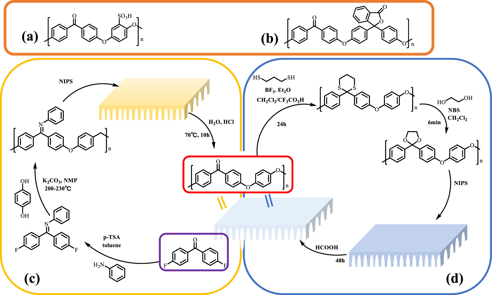
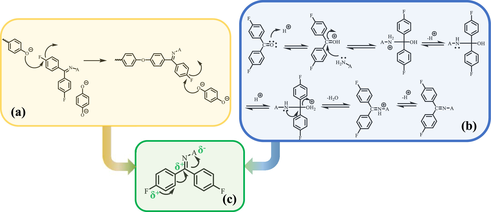
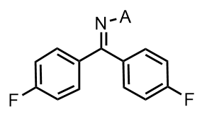
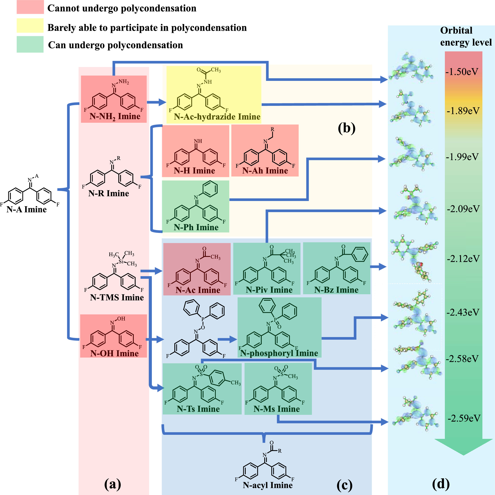
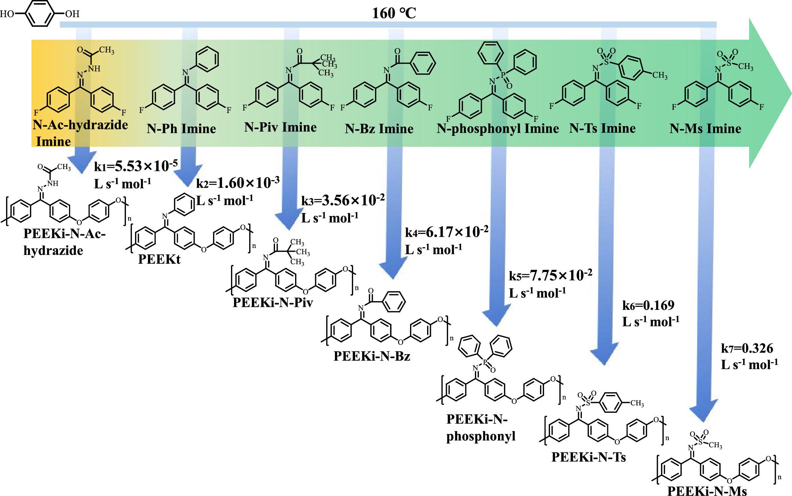
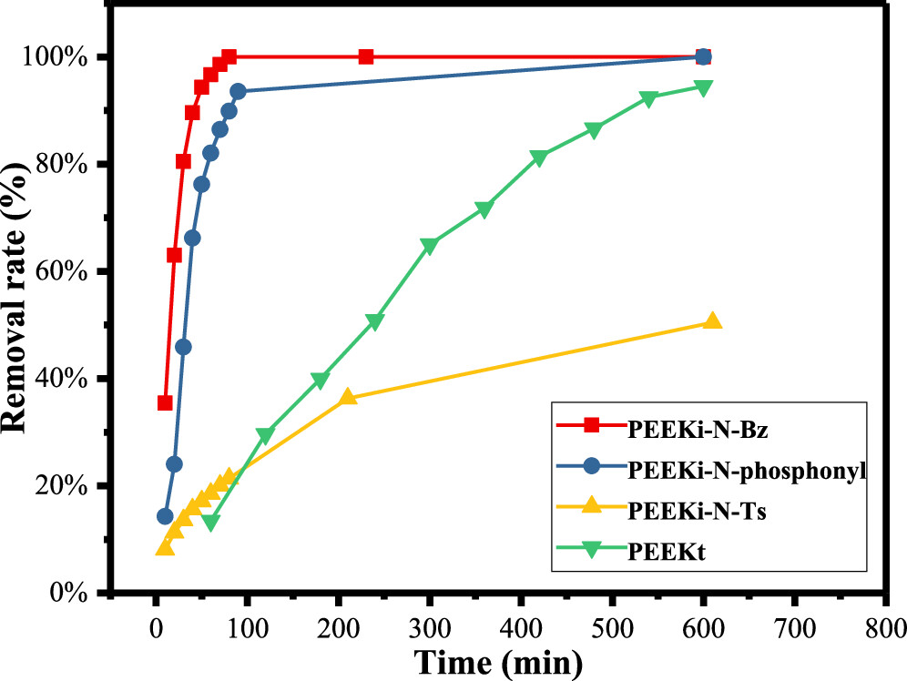
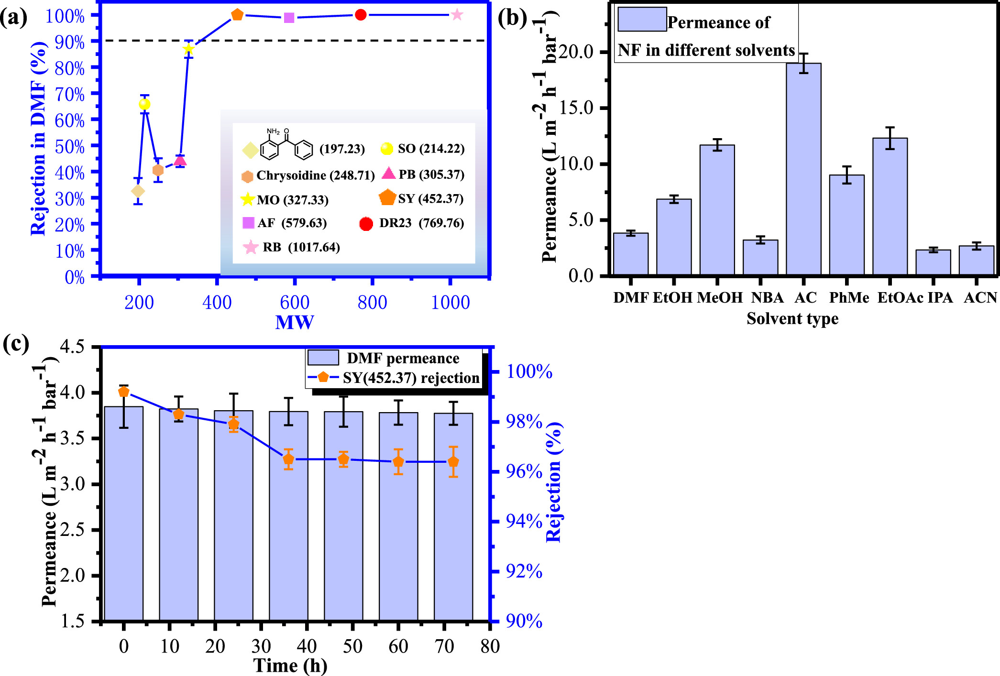
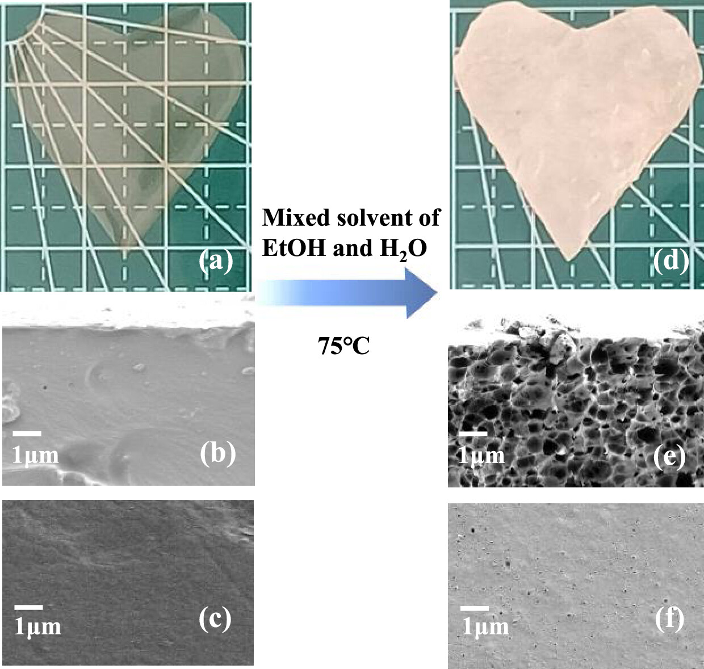
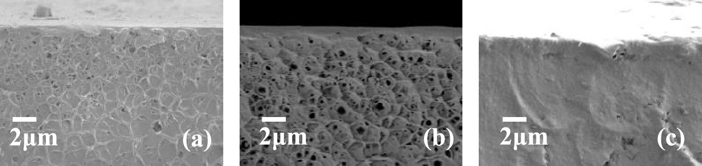
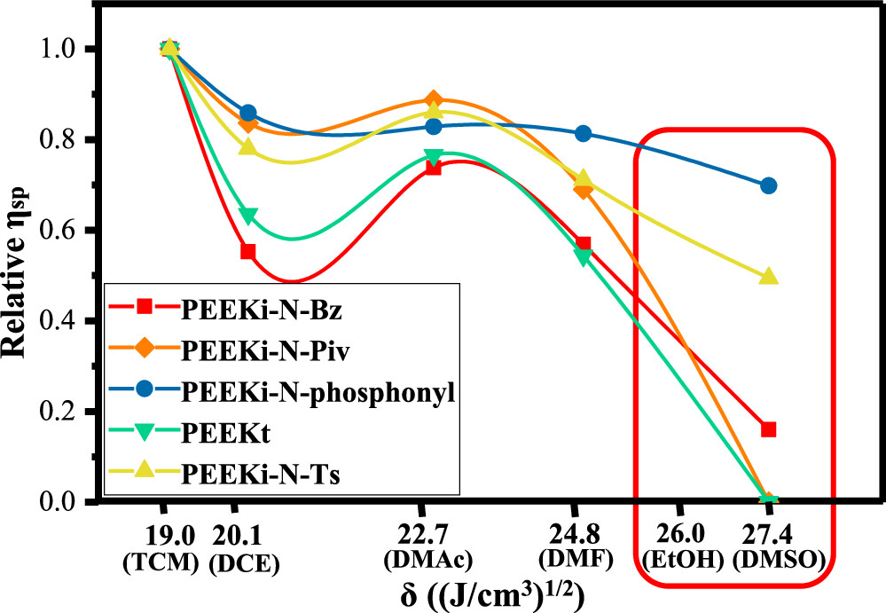

# **聚合物前驱体的设计有助于溶剂中加工聚醚醚酮膜**

PEEKt
PEEKi-N-Piv
PEEKi-N-Bz
PEEKi-N-phosphonyl
PEEKi-N-Ts
PEEKi-N-Ms

Imine 亚胺
Acyl 酰基
本项目设计了一系列带有**N-酰基亚胺**基团(N-acyl Imine groups)的聚醚醚酮聚合物前驱体(PEEKi-N-acyl)

## 摘要
1.通过研究参与缩聚反应的亚胺单体的结构模式
本项目设计了**一系列**带有 N-酰基亚胺基团的聚醚醚酮**聚合物前驱体** (PEEKi-N-acyl)。
PEEKi-N-acyl**疑似为**
PEEKi-N-Piv
PEEKi-N-Bz
PEEKi-N-phosphonyl
PEEKi-N-Ts
PEEKi-N-Ms
[表 1]

2.与传统的聚醚醚酮（PEEK）相比，这些聚合物前驱体具有更优异的溶解性，使得它们能够在溶液中进行生产和加工成膜组件。膜组件的物质可以在酸性环境中发生亚胺解反应，重新转化为 PEEK，从而赋予其溶剂抗性。
PEEKi-N-acyl在**酸性环境**中发生**亚胺解反应**，重新转化为 PEEK
3.此外，该系列的均质聚合物膜在乙醇的作用下会自发形成孔隙，这是由于溶剂引起的内部应力松弛所致。通过利用此类聚合物的特性，聚合物前驱体可以被加工成类似海绵的多孔 PEEK 膜，从而扩展了 PEEK 的加工形态和应用范围。
均质聚合物膜在**乙醇**的作用下加工成类似海绵的多孔 PEEK 膜

**酰胺**(iamide)在构造上
可看作是羧酸分子中**羧基**的羟基被氨基或烃氨基（$-NHR$或 $-NR_2$）取代而成的化合物；
也可看作是氨或**胺分子**中氮原子上的氢被酰基取代而成的化合物。

**酰基** (acyl group)，是指有机或无机含氧酸去掉一个或多个羟基后剩下的原子团，通式为 R-M (O)-。
**亚胺基团**（Imine group）是一种有机化合物中的官能团，其结构式为 C=N-C。具体来说，它由一个碳原子通过双键与一个氮原子相连，而这个氮原子又通过单键与另一个碳原子相连。这种结构使得亚胺基团具有一定的极性和反应活性。
亚胺是羰基（醛羰基或酮羰基）上的氧原子被氮所取代后形成的一类有机化合物，通式是 $R_2C=NR^{'}$，其中 R 和 R′可以是烃基或氢。氮原子还携带一个氢原子或另一些有机物残基。亚胺一般都不稳定，往往难以分离得到。但碳-氮键与**芳基**相连的亚胺一般都比较稳定，通常称为席夫碱。

亚胺水解的典型产物是醛或酮以及相应的胺类化合物：
例如，RCH=N-R' 在酸性条件下水解生成 RCHO（醛）和 R'NH₂（胺）。
RCH=N-R' + H₂O → RCHO + R'NH₂（在酸性条件下）。
在本论文中，亚胺在酸性条件下水解生成 RC=OR'（酮）和 R'NH₂（胺）。：
RCR'=N-R'' + H₂O → R─CO─R‘+ R''NH₂（在酸性条件下）。
而本文中**N-酰基亚胺PEEKi-N-acyl 水解**：
即在酸性条件下将亚胺结构水解成羰基，完成 PEEKi-N-acyl 向 PEEK 转变的过程
RCR'=N-C(=O)-R''+H₂O→ R─CO─R‘**酮**+R''-C (=O)NH₂**酰胺**
生成**酮**和**酰胺**
而酰胺在酸性条件下也会水解成酸和铵根
$H^+$ + $R''-C (=O) NH₂$ + $H₂O$ → $R''-COOH$ + $NH_{4}^+$
综上所述：
**N-酰基亚胺 PEEKi-N-acyl 水解**生成：
R─CO─R‘**酮**和 $R''-COOH$ + $NH_{4}^+$

## 引言

在节能方面，耐溶剂**膜分离技术**优于依赖相变的**精馏技术**。
在有机溶剂中应用**膜分离**的先决条件是**功能稳定**性和**耐溶剂性**。
此外，基于特定的使用条件，分离膜需要一定的机械稳定性，耐高温性，耐酸性等等。
**聚醚醚酮**(PEEK)是聚芳醚酮家族中最著名的高性能聚合物(HPP)，由**苯酚**和**二苯甲酮**单元组成。
PEEK 作为一种具有稳定性能的材料，完全满足功能性先决条件但受限于本身的加工稳定性。

对于 PEEK，好的溶剂仅包括浓硫酸 (98 %) 和甲磺酸。这两种溶剂并不推荐在实际加工应用的原因不仅是它们的腐蚀性，而且因为：首先，强酸溶液会造成 PEEK 分子链的磺化，因此影响膜的耐溶性；其次，强酸会让使用添加剂改变膜的性能变得困难。这些原因促使研究者不断寻找新的 PEEK 膜制造工艺。

[图 1]. (a) SPEEK 的结构式；(b) PEEK-WC 的结构式；(c) 使用 PEEKt 加工 PEEK 分离膜的加工过程示意图；(d) 使用缩酮聚苯醚加工 PEEK 分离膜的加工过程示意图。

### 功能性
磺化聚醚醚酮 (SPEEK) [1 a]
Cardo Groups 是一类以芴等稠环芳烃为核心的刚性功能基团
卡多基聚醚醚酮 (PEEK-WC) [1 b]
与各种不可逆的化学修饰和改进相比，使用 PEEK 聚合物前驱体生产膜，然后使用化学工艺将其转化为 PEEK，是一种更有用的想法。
### 耐溶解

N, N-二甲基甲酰胺 (DMF) 万能溶剂
在处理 PEEK 膜时使用由二硫酮/缩酮基修饰的缩酮聚亚苯醚结构 [1 d]
PEEKt 分子链上的 N-Ph 基团还防止分子链堆积而导致聚合物增溶 [1 c]

聚芳醚酮前驱体的结构类型包括**缩酮型**和**亚胺型**
本文讲解**亚胺型**
## 实验部分
材料
PEEK 不对称膜的制备：聚合物前驱体 PEEKi-N-Bz 聚合得到 PEEK 不对称纳滤膜

PEEK 海绵多孔膜的制备：由 PEEKi-N-phosphonyl 在乙醇作用下得到一片海绵状 PEEKi-N-phosphonyl 均质膜，聚合物前驱体的孔隙形成伴随着亚胺水解反应
## 结果与讨论

### 二氟苯亚胺单体的设计

[图 2]. (a) 缩聚反应原理;(b) 亚胺的生成及水解反应机理;(c) 可参与缩聚反应的亚胺单体的结构规律

举例：
合成 PEEK 聚合物前驱体:

[4,4 ‘-二氟二苯甲酮]亚胺化得到N-acyl亚胺结构[二氟化N−A亚胺]

[苯酚]亲核攻击亚胺结构单体[二氟化N−A亚胺结构]发生缩聚反应得到聚合物前驱体（如N-acyl亚胺结构缩聚为PEEKi-N-acyl）

聚合物前驱体（亚胺单体）聚合，然后聚合物水解成高分子化合物

如图[ 2 a ]所示，缩聚的每一步都涉及“活化芳族亲核取代 (SNAr)”反应，其中连接氟原子的碳被苯酚单体亲核攻击，完成取代反应。
如图[ 2 b ]所示，亚胺的水解满足“亲核加成-消除机制”。
如图[ 2 c ]所示，增加了这两个位点被亲核试剂攻击的可能性，并使单体在反应性方面达到参与合成 PEEK 聚合物前驱体的要求。

对于[二氟化 N−A 亚胺]，在寻找合适的亚胺结构时，经典的亚胺结构及其衍生物可以作为结构框架如图 3 所示。

[图 3].N−A亚胺衍生结构参与缩聚反应的能力(a)N−A亚胺的经典衍生物结构(N-NH2亚胺、N−R亚胺、N−OH亚胺和N-TMS亚胺)；(b)N-NH2亚胺(N-Ac-酰肼亚胺)和几种N-R亚胺(N-H亚胺、N-Ah亚胺和N-Ph亚胺)的典型衍生物结构；(c)N-OH亚胺和N-TMS亚胺的结构修饰；(d)可参与缩聚的亚胺单体的LUMO能级。

由图 3 可知：N−A 亚胺的经典衍生物结构包括
$N-NH_{2}$ 亚胺也被称为腙结构，如**N−Ac-hydrazide 亚胺**[ 3 a ]
$N−R$ 亚胺包括 N-H 亚胺、N-Ah 亚胺和 **N-Ph 亚胺**[ 3 b ]
$N−OH$ 亚胺包括 **N-phosphonyl 亚胺**[ 3 c ]
$N-TMS$ 亚胺包括 **N-Ac 亚胺**、**N-Piv 亚胺**、**N-Bz 亚胺**、**N-Ts** 亚胺和 **N-Ms 亚胺**[ 3 c ]

N-acyl 亚胺包括
[N-phosphonyl 亚胺、N-Ac 亚胺、N-Piv 亚胺、N-Bz 亚胺、N-Ts 亚胺和 N-Ms 亚胺]
带有$αC−H$ 的酰基结构会发生分子间的“**醛醇反应**”，会导致聚合物和凝胶的分子间成键反应
除[N-Ac] 亚胺结构不能聚合外，其余 N-acyl 亚胺结构均具有优异的聚合活性。

### 亚胺单体聚合活性测试

可参与缩聚的亚胺单体的 LUMO 能级[ 3 d ]
N-acyl 亚胺的反应活性高于 N-Ph 亚胺

[图 4]. 不同亚胺单体在 160℃下的聚合反应速率常数
N−Ac-hydrazide在160℃下长时间聚合13 h后Mn仅增加到1237 g/mol
N-Ts在130 ℃下参与聚合，并在15 min内将产物的Mn提高到74441 g/mol
N-Ms 亚胺结构可以在 100 ℃时开始聚合
### PEEK 聚合物前驱体的亚胺水解能力测试

[图5].几种PEEK聚合物前驱体亚胺水解率随时间的变化

选择了 PEEKi-N-Bz、PEEKi-N-phosphonyl 和 PEEKi-N-Ts 聚合物进行了测试（这些聚合物前驱体由亚胺水解生成的酰胺具有芳香环，因此可以用紫外分光光度法测量信号）

PEEKi-N-Bz 和 PEEKi-N-phosphonyl 的侧基水解速率非常快
PEEKi-N-Ts 的亚胺水解能力似乎比 PEEKt 更弱，这表明，除了亲核攻击外，质子化对于亚胺的水解也是必要的
### 由 PEEK 聚合物前驱体制备的 PEEK 耐溶剂纳滤膜的性能

[图6].(a)DMF对PEEK纳滤膜的抑制作用；(b)PEEK纳滤膜在不同溶剂中的渗透率；(c)PEEK纳滤膜的长期稳定性测试

利用聚合物前驱体 PEEKi-N-Bz 制备的 PEEK 耐溶剂纳滤膜的分子量截止值为 400 g/mol，可以在各种有机溶剂中进行纳滤操作，甚至可以抵抗 DMF 等强极性非质子溶剂，保持功能稳定性。该膜的性能与 PEEKt 制成的 PEEK 纳滤膜相似，因此聚合物 PEEKi-N-Bz 可用于制备耐溶剂膜。
### 乙醇对聚合物PEEKi-N-phosphonyl均相膜内应力松弛现象的影响

[图 7]. (a) 由聚合物 PEEKi-N-phosphonyl 制成的均质膜；PEEKi-N-phosphonyl 均质膜的 SEM 扫描：(b) 横截面；(c) 表面；(d) PEEKi-N-phosphonyl 均质膜在酒精和水的混合物 (乙醇/H 2 O=1:3中，在 75℃下浸泡 1 小时后的宏观形貌；PEEKi-N-phosphonyl 多孔膜的 SEM 扫描图：(e) 横截面；(f) 表面

当聚合物PEEKi-N-phosphonyl的均质膜在75 ℃下以1:3的比例浸泡在乙醇与H2O的混合溶液中时，聚合物膜的宏观外观会在几分钟内发生非常显著的变化，膜外观会从透明的均质膜转变为白色的不透明膜。可以看出，“不透明”现象在微观层面对应于海绵状孔隙的出现，而表面仍然是一个相对致密的层，存在一些孔隙。

**残余应力**是固体材料加工过程中常见的现象。玻璃状聚合物薄膜中的残余应力是聚合物沉积过程中的必然结果。这些残余应力在薄膜中持续存在，直到进行足够的退火才能释放应力。当加热到**玻璃化转变温度** (Tg) 以上时，随着分子链排列到平衡状态，应力逐渐消失。

[图 8]. 不同制备条件下 PEEKi-N-phosphonyl 均质膜在 75 ℃溶液 (乙醇：H 2 O=1:3) 中浸泡 30 s 后的横截面形貌。(a) 50 ℃常压流动浇铸法成膜。(b) 50 ℃真空条件下流动浇铸法成膜情况。(c) 120 ℃常压下流动浇铸法成膜。

### 溶剂诱导内应力松弛的实验测试

这种现象是由内应力驱动的

[图9].聚合物PEEKi-N-Bz、PEEKi-N-Piv、PEEKi-N-phosphonyl、PEEKt和PEEKi-N-Ts在不同溶解度参数溶剂中的$η_sp$变化

粘度法可用于探究 PEEKi-N-acyl 系列聚合物与多种溶剂之间的相互作用关系，其结果如[图 9]
PEEKi-N-phosphonyl 最容易受到乙醇的影响
PEEKi-N-Piv 和 PEEKt 均质膜的内应力不会因乙醇的影响而松弛。

[表 1]. 聚合物前驱体的玻璃转化温度和空隙形成现象

综上所述，粘度测试和玻璃化转变温度测试结果符合 PEEKi-N-acyl 均质膜的成孔规律。确定均质膜的成孔现象受内应力，溶剂与聚合物分子之间的相互作用，以及聚合物分子之间相互作用的影响。

由此可见，PEEKi-N-phosphonyl 的磷亚胺侧基使聚合物前驱体在溶剂条件下具有不同的加工特性。结合 PEEKi-N-phosphonyl 分子链的亚胺水解能力，通过内应力松弛得到的海绵状多孔 PEEKi-N-phosphonyl 膜可转化为 PEEK 海绵多孔膜，大大扩展了 PEEK 膜的加工形貌。具有优异耐溶剂性的海绵状多孔 PEEK 膜在锂电池隔膜等领域具有应用潜力。

## 结论

1.[苯酚]亲核攻击亚胺结构单体[二氟化 N−A 亚胺结构]发生缩聚反应得到聚合物前驱体（如 N-acyl 亚胺结构缩聚为 PEEKi-N-acyl）

聚合物前驱体（亚胺单体）聚合，然后聚合物水解成高分子化合物

2.对不同[聚合物前驱体（亚胺单体）]的缩聚活性，亚胺水解能力，膜的性能，膜内应力松弛现象进行分析。

确定 N-acyl 亚胺结构中[ N-phosphonyl ]和[ N-Bz ]有较好的缩聚活性，亚胺水解能力，膜的性能。应力松弛方面，确定聚合物PEEKi-N-phosphonyl均相膜在乙醇作用下可快速转化为海绵状多孔膜。PEEKi-N-Bz 也可以制膜，但是对乙醇没有内应力松弛现象。

