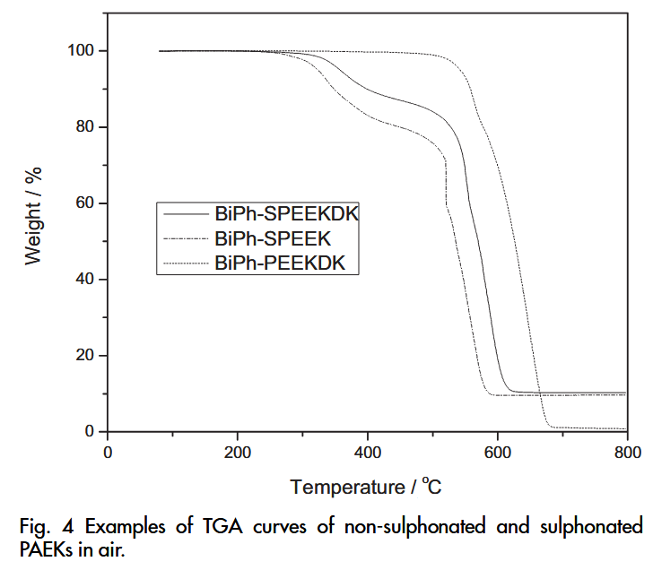

DOI: 10.1002/fuce.200900076
## 用于燃料电池应用的磺化联苯化聚（芳醚酮）
### 摘要

### 1.简介

### 2.实验
#### 2.1实验材料

| 英文                                | 中文       |
| --------------------------------- | -------- |
| 4,4′-Difluorobenzophenone         | 二氟二苯甲酮   |
| 1,4-benzoquinone                  | 对苯醌      |
| zinc powder                       | 锌粉       |
| 1,4-Bis(4-fluorobenzoyl)benzene   | 二氟三苯二酮   |
| 4,4′-bis(4-fluorobenzoyl)biphenyl | 二氟联苯二苯二酮 |
| chlorobenzene                     | 氯苯       |
| Anhydrous potassium carbonate     | 无水碳酸钾    |
#### 2.2对联苯氢醌的合成

coupling reaction偶合反应

p-biphenyl diazonium对联苯重氮盐
1,4-benzoquinone对苯醌
p-Biphenyl-quinone对联苯醌
p-Biphenyl-hydroquinone对联苯氢醌

#### 2.3起始聚合物的合成

nucleophilic aromatic substitution polycondensation亲核芳香取代聚合
一种典型合成比如：
p-biphenylated PEEK (BiPh-PEEK)对-联苯化的聚醚醚酮(BiPh-PEEK)
p-biphenyl-hydroquinone对联苯氢醌
4,4′difluorobenzophenone二氟二苯甲酮
anhydrous K2CO3无水碳酸钾
N-methylpyrrolidone (NMP)
toluene

#### 2.4磺化反应和膜的制备
**磺化BiPh-SPEEK**
BiPh-PEEK，浓硫酸在室温下搅拌5小时后，均匀的粘稠溶液沉淀到冰水混合物中，得到丝状固体。
**膜的制备**
将0.5g的上述干燥聚合物溶解在15 mLDMAc中，并通过过滤纸过滤该溶液。将滤液倒入玻璃板上，并在50°C的烤箱中在持续缓慢的氮气吹扫下干燥一周。将所得柔性膜在真空烤箱中于120 °C干燥24小时。
#### 2.5特征化与测量
核磁共振光谱仪1H的频率为399.95 MHz，13C的频率为100.575 MHz。

元素分析仪

乌氏粘度计

热重分析仪(TGA)：评估热稳定性

差示扫描量热仪 (DSC)[第2章热力学第一定律](学习/项目/物理化学/Askins‘%20PHYSICAL%20CHAMISTRY/第2章热力学第一定律.md#差示扫描量热法)：评估玻璃态转化温度

电化学阻抗谱：评估电子传导率
测试前，将20 mm x 10 mm条带形式的样本在去离子水中浸泡48小时。
R源自复阻抗平面上的高频半圆与Re（Z）轴的低交。

采用典型的滴定法测量磺化聚合物的IEC，以酚酞为指示剂测定膜中H+的释放量

MEA制备和燃料电池操作条件

### 3结果与讨论
#### 3.1含联苯侧基的全芳香族PEKs的合成
需要开发具有功能团或激活反应位点的新结构PAEK，以便其在新领域的进一步应用
在本研究中，制备了一系列具有庞大联苯侧基的新全芳香族PAEKs，并研究了它们的进一步官能团化以引入磺酸基。

**含联苯侧基的全芳香族PEKs的合成是亲核取代聚合**
#### 3.2BiPh-PEKs的磺化反应
通过**后磺酸化**反应制备的磺酸化聚合物通常对DS和取代位的可控性较差。

磺化剂：
fuming sulphuric acid发烟硫酸
chlorosulphonic acid氯磺酸

磺化度DS通常通过反应时间进行调整，导致其精确控制困难。

这与PEEK的磺酸反应形成鲜明对比，后者发生在数百小时的长反应期内。

**磺化是亲电芳香取代反应**其中芳香物上的氢原子被硫酸取代

根据1H核磁共振光谱分析估计的DS值作为反应时间的函数

失活的-SO3H的位置位于足够靠近主线反应位点的结合体系上，以降低骨架的活性

#### 3.3膜的热力学性能
全芳香PEKs有：高玻璃化转变温度（Tg），高热降解温度
**在绝大多数高分子材料中，热降解温度显著高于玻璃化转变温度（Tg）**

玻璃化转变温度（Tg）：指高分子材料从刚性玻璃态转变为柔软高弹态的温度，是分子链段开始运动的标志；反映分子链段运动能力的转变，属于物理状态变化（无相变热），与材料柔韧性相关。

热降解温度：指材料因高温引发化学键断裂、发生不可逆分解的温度，通常伴随质量损失和分子结构破坏；涉及化学键断裂（如C-C、C-H键），需更高能量输入，通常需要高于Tg的温度才能触发。

大且刚性的侧链阻碍了分子链片段的移动，导致玻璃化转变温度（Tg）比较高。所有磺化的样品都表现出热降解温度降低。硫酸基的酸度较低，为维持高质子导电性，具有高含量的硫酸基的聚合物的尺寸和机械完整性较差。

综合可知：磺化提高玻璃化转变温度（Tg），降低热降解温度，尺寸和机械完整性较差。

高转变温度和良好的热稳定性的结合满足了这些磺化PAEKs在燃料电池系统中在较高的操作温度下运行的热要求。

设计既具有**高质子传导性**又具有良好的机械性能、合理的吸水性和尺寸稳定性的有效PEM材料是需要平衡这些矛盾要求的关键考虑因素之一。

polymer electrolyte membranes (PEMs)聚合物电解质膜

如图5所示，这三种材料的屈服应力和杨氏弹性系数比Nafion 117高得多。相比之下，各个未磺化聚合物的拉应力在90-100 Mpa范围内，杨氏弹性系数为2.0- 2.3GPa，断裂延伸率为15- 30%。

#### 3.4SPEK膜的尺寸稳定性和质子导电性

SO3H含量高质子导电性倾向于导致膜膨胀、尺寸不稳定和机械脆弱性
有效质子交换机的设计涉及开发能够平衡高质子导电性、良好的机械强度和尺寸稳定性等矛盾性质的材料。

ion exchange capacity (IEC)离子交换容量

如表3所示，这三种材料在80 °C的水中具有合适的膨胀比和水吸收，也适合在80 °C下保持1.1 x 10-1，1.3 x 10-1 S厘米-1的高质子电导率。
#### 3.5膜的DMFC性能
工业标准Nafion
DMFC性能取决于膜电导率和甲醇渗透性的耦合效应，这些性能是**膜厚度**的函数

较厚的Nafion膜由于甲醇渗透率低而具有更好的性能，而较薄的碳氢化合物膜由于DMFC应用的低阻力而具有更好的性能

我们将相对较薄的BiPh-SPEEKDK（53 lm）膜与相对较厚的Nafion版本（Nafion 117，180 lm）和同等厚度的Nafion（Nafion 112，50 lm）进行了比较。

如图6所示，BiPhSPEEKDK在0.5V、80 °C、1 M和2 M甲醇中的电流密度分别达到195和117 mA厘米-2。基于BiPh-SPEEKDK的多边电池组的DMFC性能与Nafion 112和117相当甚至更好。特别是，在2 M甲醇中的测试条件下，BiPh-SPEEKDK在80 °C下的性能优于Nafion 112。

BiPh-SPEEKDK性能的提高可以通过较低的高频电阻（HFR）（2 M时95 mX厘米2）和较低的甲醇交叉限制电流（2 M时328 mA厘米-2）的组合来解释。

### 4结论
BiPh-p-SPEEKK (DS = 1)
BiPh-m-SPEEKK
BiPh-SPEEKDK

BiPh-SPEEKDK性能的提高可以通过其高质子导电性和低甲醇渗透性来解释。

